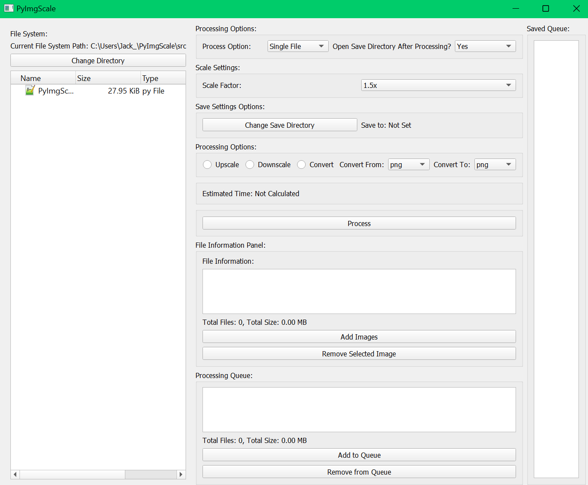

# PyImgScale - Image Processing Tool



## Overview
PyImgScale is a local GUI image processing application built on PyQt5 and Pillow. It allows for upscaling, downscaling, and converting of images between a few common image formats. PyImgScale provides a user-friendly interface to navigate through the filesystem, select images for processing, and manage processing queues. It will make use of multithreading to process images as efficiently as possible over traditional singlethreaded programs.

It is still currently in active development.

## Note
PyImgScale is not finished at the moment. There are still a few bugs, code cleaning, and features to implement (image upscaling/downscaling are close to being implemented, but just have not gotten around it just yet!). Single file and batch conversions of files should 

## Features
- **Filesystem Navigation**: Browse through your file system within the app to locate images.
- **Image Processing**: Upscale or downscale images with selectable scale factors.
- **Format Conversion**: Convert images between popular formats like PNG, JPG, BMP, and more.
- **Batch Processing**: Process multiple images at once, with progress tracking via a progress bar.
- **Preview Thumbnails**: View thumbnails of the selected images before processing.
- **Customizable Save Directory**: Choose a custom directory where processed images will be saved.

## Prerequisites
Before running PyImgScale, ensure you have the following installed:
- Python 3.x
- PyQt5
- Pillow (PIL Fork)

You can install the required packages using pip:
```sh
pip install PyQt5 Pillow
```

## Usage
To start the application, navigate to the script's directory and run:
```sh
python PyImgScale.py
```

Once started, the application will present you with the main interface where you can navigate your filesystem, select images, choose processing options, and initiate image processing.

## Development Status
This tool is currently under development. Some features might not be fully implemented, and functionality is subject to change.

## Contributing
As a very small solo project, contributions to PyImgScale are not welcome. However, please feel free to fork the repository and modify it to your heart's content!

## License
PyImgScale is released under the [MIT License](LICENSE).

## Disclaimer
PyImgScale is in no way related to or apart of 'PyImg'.
